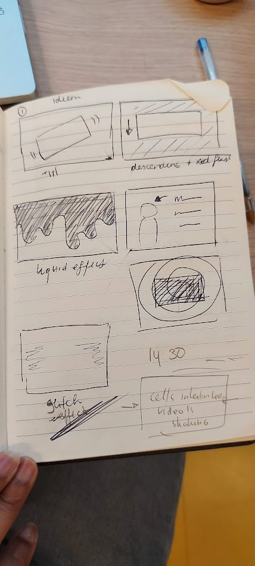
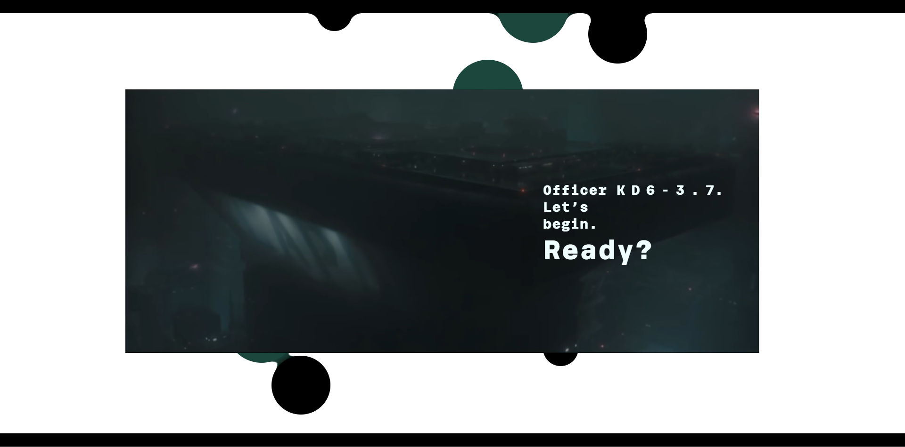
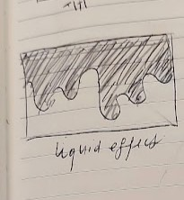
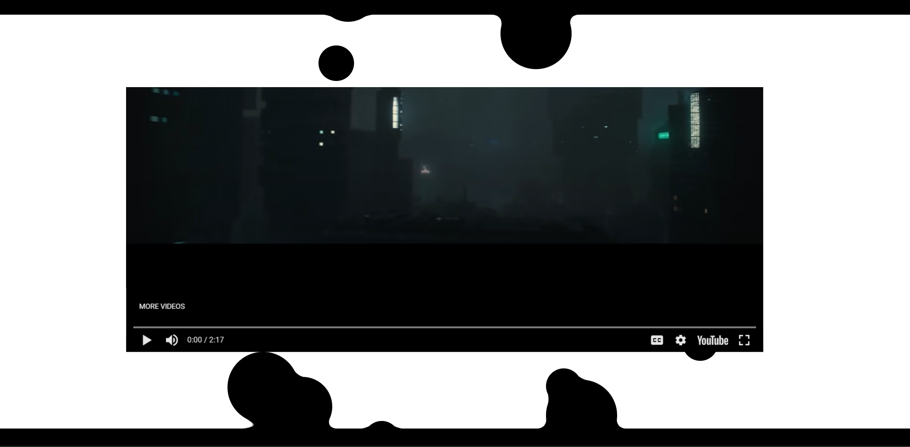
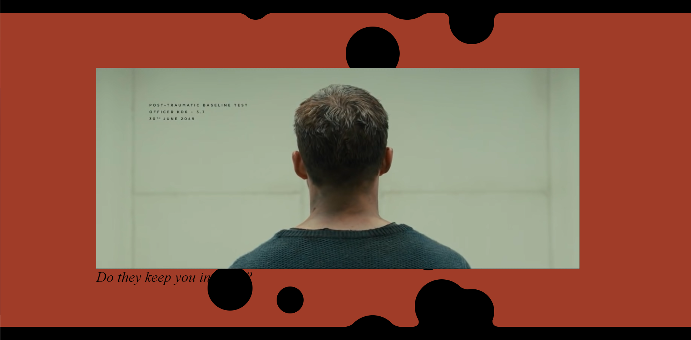
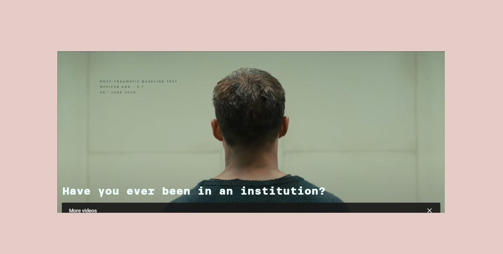
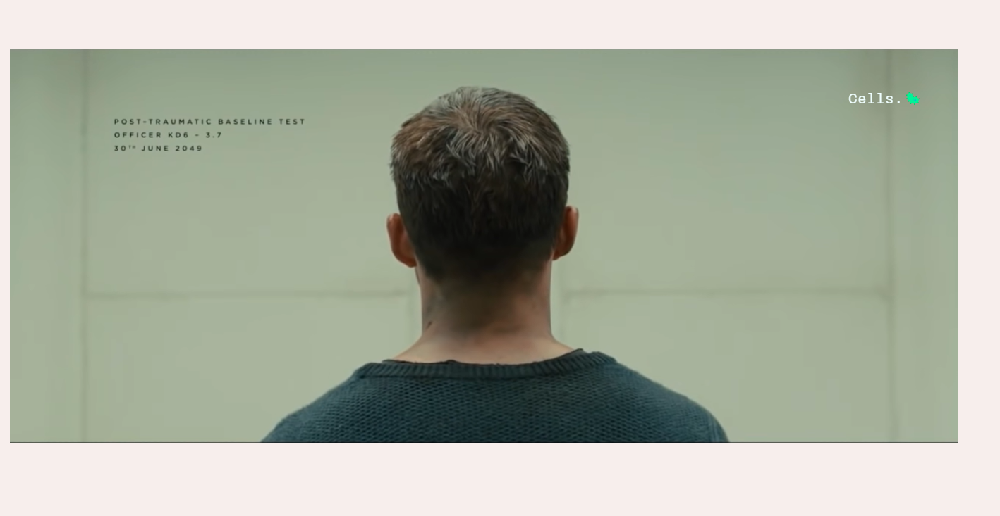
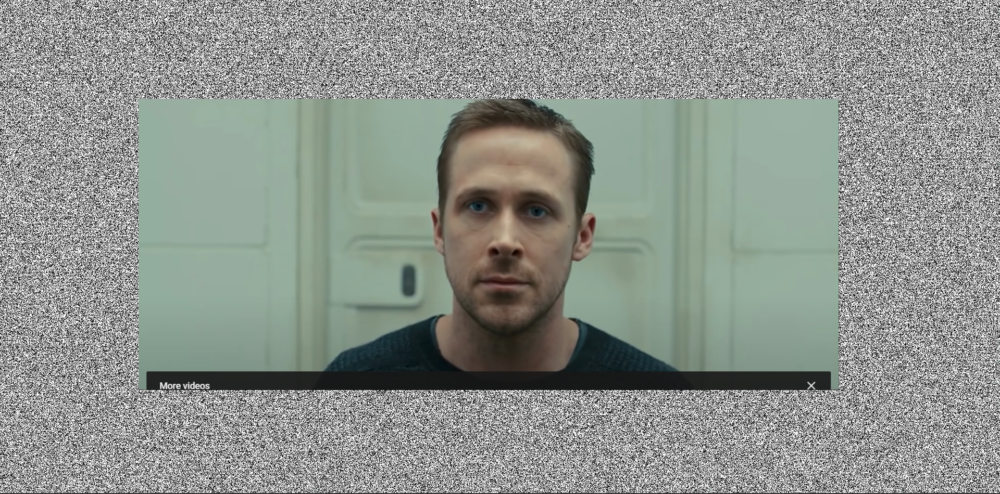

# Web Typografie
## Inleiding
Voor web typografie moeten we een filmfragment vormgeven voor mensen die doof zijn geboren. De filmfragment gaat over de film blade runner. Blade runner is een science fiction fllm. Zonder geluid kun je aangegeven dat het gaat over een science fiction film door het  sombere sfeer, maar het is saai en je kan niks begrijpen.  Met geluid kun je  hoor je een verschillende geluiden die het fragment spannender maakt. 

Aan mijn de taakt om het filmfragment spannender en somber maken voor de mensen die doof zijn met behulp van CSS. 

### Taak
>Filmfragmenten vormgeven voor  mensen die doof zijn geboren.
Ik moet gaan vormgeven op basis van deze vier principes  van Exclusive design namelijk:

-  Study situation 
- Ignore Conventions
- Prioritise Identity
- Add Nonsense 

#### Inleveren
- Werkende versie op Github pages
- Documentatie op Readme
- Screen recorder met Audio
- Zip folder van het werk 

---
# Het proces
## Study situation
Wat ik eerst heb gedaan om het filmfragment beter te begrijpen, was de hele film bekijken. Hiermee heb ik wat ideen opgeschren en geschets die ik kan toevoegen. Bovendien heb ik een beetje nagedacht aan de sfeer die het film navoren brengt en die waren:
- scifi
- Onbegrijpbaar
- raar 
- saai 

In mijn concept wilde ik gaan proberen om een combinatie van deze woorden toe te passen.

## Ideeën
Het volgende stap was ideeën bedenken. Voor mijn concept heb ik verschillende ideeen geschets om een overzicht te krijgen hoe die eruit ziet. 

### Hier zijn de eerste brainstorming:
In mijn brainstorming heb ik verschillende ideeën geschetst. De ideeën hebben te maken met kleur, beweging en  illustraties. Om dat te bereiken ga ik animeren met css. Ik wil gaan spelen met animaties om mijn vaardigheden te verbeteren
Wat ik in mijn project wil terug zien zijn:
- Bewegende video container
- Liquid effect achtergrond
- Descending video container
- Glitching text/ achtergrond effect
- Optical illusion achtergrond
- Illustratie aan het einde van Fragment 1 
- Grote woorden op een random plek van de webpagina.

> Deze ideeen zijn gemaakt op basis van het geluid die ik moet vormgeven, de sfeer van de film en de betekenis van de tekst. 

Verder ging ik zoeken naar verschillende manieren hoe ik de effecten en animatie kan toepassen met css. 
Een paar kon ik zelf doen en die test ik op codepen. Andere heb ik gevonden op andere bronnen en youtube.  Alle bronnen staan helemaal onderaan. 

## Typografie
Een onderdeel van dit opdracht is ook de juiste lettertype kiezen om de geluiden en stemmen goed  te vormgeven. Ik heb gekozen voor de lettertype brenner omdat die verschillende soorten stijlen heeft.. In mijn video heb ik Brenner monospaced font-family gebruikt. Bijna alle karakters praten heel erg monotoon. Er zijn verschillende karakters in de fragment. Ik ga de tekst vormgeven op basis van emoties.

1. Het persoon achter de radio
2. De hoofdpersonage 
3. Persoon die vloekte
4. Persoon die zegt " You can pick up your bonus".

### Het persoon achter de radio/microfoon
Het persoon achter de microfoon spraak bijna de hele filmfragment. Zijn doel was vragen stellen om de hoofdpersonage te testen.  Door de radio klinkt hij robotisch. Hij spreek luid en duidelijk. De beste lettertype voor dit stem was Brenner Monospaced bold. Want het geef aan dat de spreker een robotische stem heeft en is in controle van de situatie. Soort van ik ben degene die vragen stelt en jij (de hoofdpersonage) beantwoord. 

### De hoofdpersonage 
De hoofdpersonage is een biotechnologisch android die zorg ervoor dat de oude versie androids verdwijnen. Gedurende de film dacht hij dat hij gekozen was om een revolutie te zorgen tussen mensen en androids. 

Tijdens de film zag ik dat hij geen oogcontact houdt met de lapd officiers. Hij is onderukt en gediscrimeerd door de mensen rondom hem. Dus stem geeft een gevoel van onderdanigheid en passiviteit. Hij is een "robotische" mens die monotoon en rustig praat. Hij moet tijdens zijn test antwoord geven.  In de eerste fragment   bentwoorde  hij op een saaie manier omdat hij heeft de test zoveel keren gedan dus hij weet wat hij moet zeggen en heeft de test behaald. Daarom heb ik de lettertype Brenner monospaced regular.

### Persoon die vloekte
Deze scene vindt plaats in de eerste fragment. Hij is een de lapd officier die tegen de hoofdpersonage vloekt. De manier hoe hij dit zegt is agresief en subtiel. Het geef aan de haat tegen de androids. Voor hem heb ik de font Brenner sans light gebruikt. Met dit lettertype kan ik aangeven dat dit karakter een "echte" mens is en de zachte manier hoe hij het woord naar de personage zegt.

Met CSS kon ik het  woord laten bewegen. Het woord wordt gegooid naar de hoofdpersonage toe. Dan lijkt het aggresief maar ook nog op een zachte manier.

## Filmfragment 1

### Liquid effect
Het filmfragment begint met de  personage in zijn voertuig te draaienns. Dus ik wil de video meedraaien. Terwijl in de achtergrond iets vloeibaar naar beneden valt. Het geef een gevoel van weirdness aan. Voor de rest heb ik een reden waarom ik de effect heb geplaatst, maar ik vond het tof genoeg en voltooid aan het principe: add nonsense.

#### Iteraties van de effect
  

De eerste versie van dit animatie was een schets die ik heb gemaakt tijdens mijn ideation fase. Ik had verschillende bronnen gezocht voor een vloeibare druppel achtergrond, maar ik was niet succesvol. Dus uiteindelijk heb ik verschillende manieren geprobeerd en heb uiteindelijk een oplossing gevonden. 

Ik heb een instructivideo gevolgd en de animatie helemaal uitgewerkt. De eerste versie was helemaal zwart maar daarna heb ik donkere groene tinten aan de druppels gegeven. Want deze kleuren passen betere in de eerste scene van de video. 

## Baseline test
De volgende scene gaat over de baseline test, hier gebeurde verschillende dingen die ik kan vormgeven. Bijvoorbeeld de vloek, de irritante piep geluid en de test. 

### Achtergrond kleur bij Alarm
Ik begin eerst met de achtergrond geluid. Terwijl de hoofdpersoon aan het beantwoorden was hoor je een alarm. Er zijn vier alarmgeluiden voordat de piep geluid komt. Wanneer je de alarm hoort verandert de achtergond kleur van wit naar rood (versie 1). Bij de eerste versie verandert elk achtergrond in een felle achtergrond kleur.

In de eerste versie verandert alarm 1:  Linear gradient, Alarm 2: licht Oranje achtergrond  Alarm 3: Oranje, Alarm 4: Roodoranje achtergrond. De bedoeling was  om een intensisteit  niveau weertegeven voor de piepende geluid. Licht oranje wordt gezien als minder intens en rood wordt ge zien als intens en waarschuwing. 

#### Iteraties

Voor mijn eerste versie wilde ik dat de video gaat schudden tijdens de alarm maar uiteindelijk heb ik gekozen om de achtergrond kleur te veranderen. Ten eerste heb ik voor rood gekozen omdat het geef een gevoel van urgentie en ik asosieer het met een alarm bel kleur. 

## Irritante geluid
Zonder geluid zie je alleen de hoofdpersonage die vragen beantwoorden bij de test. Met geluid hoor je een  iritante piepende geluid. Het moet ook iritant zijn voor mensen die doof zijn. Dus dat heb ik bereik gemaakt door een knipperende achterdond animatie te maken die irritant zijn voor je ogen. Een passende kleur die ik heb gebruikt is een verzadigde rode kleur. ..Rood is een agressieve kleur en als die verkeerd gebruikt wordt (*ignore conventions*) maak je ogen vermoeiend.

Tijdens de piep geluid, beweegt de video zelf. Hier wil ik illustreren hoe vervelend de hele geluid is terwijl de test worden genomen. 

Uiteindelijk stopt de piepende geluid en dus de achtergrond wordt verandert naar een lichte groene kleur. Hiermee word er bedoeld dat de Constant K de test heeft behaald maar ook de rust na de chaos.

### Captions
De subtitels onderaan de videos heb ik aangepast volgens de emoties achter de stemmen. Maar ook per stem een andere positie gegeven op de video. Links onder heb je de stem achter de microfoon en rechts boven de stem van de hoofdpersonage constant K. De reden hiervoor is dat met de koptelefoon kan  ik aan de ene stem aan de linker oor horen  en de andere aan de rechter oor. 

#### Wat heb ik gedaan bij de subtitels
- Woorden aan elkaar plakken bij within Cells interlinked.
- Kleine animaties bij verschillende woorden
- Emoji aan de tekst toevoegen voor meer context te geven aan de tekst.
- Groene kleur die aangeeft dat de test is behaald en rode kleur  wannneer de test is gefaald.

---
## Filmfragment 2

Het geluid bij de tweede fragment laat me denken aan optical illusion, ik wilde eerst een spiral optical illusie toevoegen toevoegen. Dus ik heb een andere alternatief gevonden. 

### TV- Static effect
Wanneer de tv geen verbinding hebt met de antenna krijg je een  statisch beeld en geluid te zien. Ik assosieer dat ook als een illusie en het is hypnotiserend. 

### Uitzoomen van de video
In deze scene is de hoofdpersonage weer getest op zijn baseline, maar hier is hij niet zichzelf en is een beetje nerveus. Deze effect geef aan hoe iedereen aan hem richt en spanning van de karakter zelf. 

---
## Voortgang 1

## Voortgang 2
